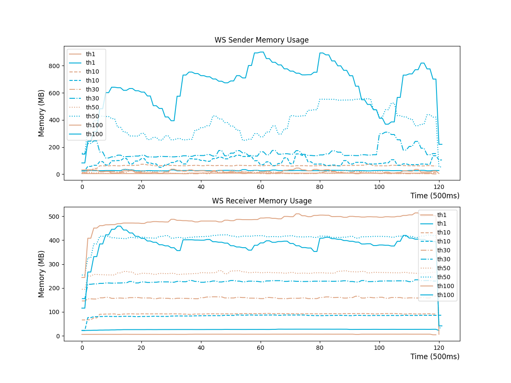
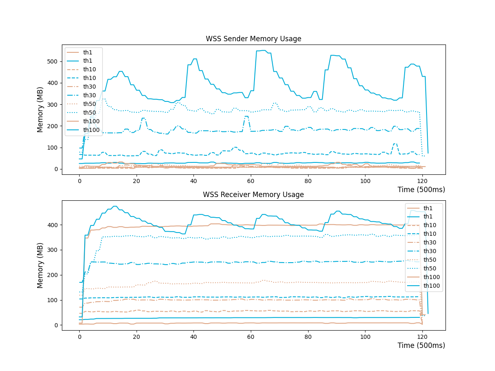

# NO WARRANTY

Data are roughly collected. You should never rely on these results for any serious purpose.

## Tool

Realm:

```shell
realm -v
Realm 2.0.0 [udp][zero-copy][trust-dns][proxy-protocol][multi-thread]
```

Gost:

```shell
gost -V
gost 3.0.0-beta.2 (go1.18.1 linux/amd64)
```

## Environment

Run these tools in a container:

```shell
docker run -it --cpus=0.5 --name=relay bench /bin/bash
```

We simply limit CPU usage to make sure network would not become the bottleneck during a benchmark. And there is no extra restriction on memory usage.

## Command

A(host) => B(docker) => C(docker) => D(host)

A:

```shell
iperf3 -c 172.17.0.2 -p 8080 -t 60 -P [1,10,30,50,100]
```

D:

```shell
iperf3 -s -p 5201
```

### TCP

Realm:

```shell
realm -l 0.0.0.0:8080 -r 172.17.0.1:5201 -z
```

Gost:

```shell
gost -L tcp://:8080/172.17.0.1:5201 2>/dev/null
```

### WS

Realm:

```shell
realm -l 0.0.0.0:8080 -r 172.17.0.3:8080 -b 'ws;host=abc;path=/'
realm -l 0.0.0.0:8080 -r 172.17.0.1:5201 -a 'ws;host=abc;path=/'
```

Gost:

```shell
gost -L tcp://:8080 -F relay+ws://172.17.0.3:8080 2>/dev/null
gost -L relay+ws://:8080/172.17.0.1:5201 2>/dev/null
```

### WSS

Realm:

```shell
realm -l 0.0.0.0:8080 -r 172.17.0.3:8080 -b 'ws;host=abc;path=/;tls;insecure;sni=abc'
realm -l 0.0.0.0:8080 -r 172.17.0.1:5201 -a 'ws;host=abc;path=/;tls;servername=abc'
```

Gost:

```shell
gost -L tcp://:8080 -F relay+wss://172.17.0.3:8080 2>/dev/null
gost -L relay+wss://:8080/172.17.0.1:5201 2>/dev/null
```

## Result

Memory Usage:

TCP: 

WS: 

WSS: 
